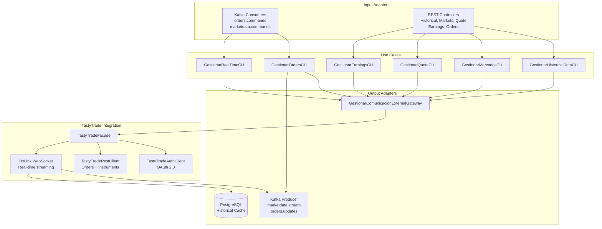
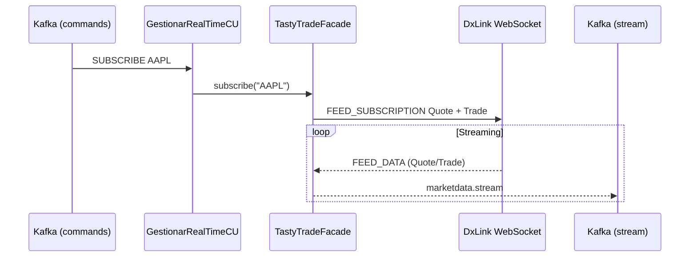
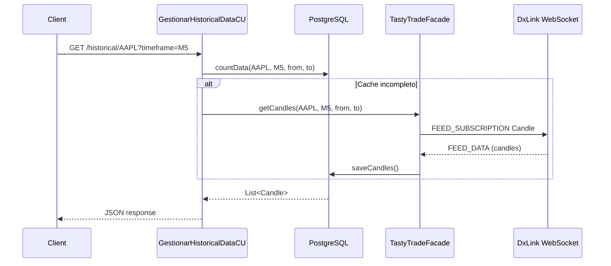
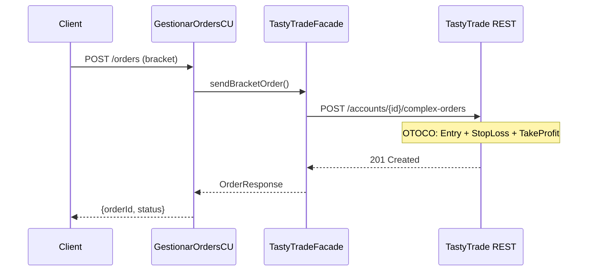
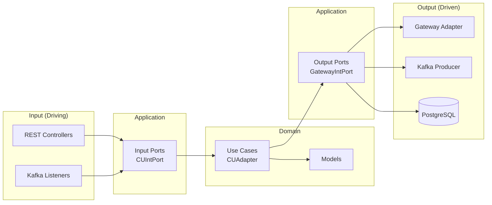

# MarketData Service

Microservicio de datos de mercado con integracion a TastyTrade (OAuth 2.0, DxLink WebSocket, REST API para ordenes).

## Arquitectura



## Flujo Real-Time



## Flujo Historical Candles



## Flujo Bracket Order (OTOCO)



## REST API

| Metodo | Endpoint | Descripcion |
|--------|----------|-------------|
| GET | `/api/marketdata/historical/{symbol}` | Candles historicos (`?timeframe=M5&from=...&to=...`) |
| GET | `/api/marketdata/markets` | Mercados disponibles (NYSE, NASDAQ, AMEX, ETF, OTC) |
| GET | `/api/marketdata/symbols` | Simbolos por mercado (`?markets=NYSE,NASDAQ`) |
| GET | `/api/marketdata/quote/{symbol}` | Quote actual (bid, ask, last, halt status) |
| GET | `/api/marketdata/earnings/{symbol}` | Proximo earnings report |
| POST | `/api/marketdata/orders` | Enviar orden bracket (OTOCO) |
| DELETE | `/api/marketdata/orders/{orderId}` | Cancelar orden |

## Kafka Topics

| Topic | Direccion | Payload |
|-------|-----------|---------|
| `orders.commands` | IN | `{symbol, action, quantity, type, price, stopLossPrice, takeProfitPrice}` |
| `marketdata.commands` | IN | `{symbol, action: SUBSCRIBE/UNSUBSCRIBE}` |
| `orders.updates` | OUT | `{orderId, status, receivedAt}` |
| `marketdata.stream` | OUT | `{symbol, lastPrice, bid, ask, volume, timestamp}` |

## Stack

| Componente | Tecnologia |
|------------|------------|
| Runtime | Java 21 + Spring Boot 3.5.9 |
| Base de datos | PostgreSQL |
| Mensajeria | Apache Kafka |
| WebSocket | DxLink (TastyTrade) |
| Mapping | MapStruct 1.6.3 |
| Auth | OAuth 2.0 (refresh_token) |
| Service Discovery | Eureka |

## Configuracion

### Variables de entorno requeridas

```bash
TT_CLIENT_ID=...
TT_CLIENT_SECRET=...
TT_REFRESH_TOKEN=...
TASTYTRADE_ACCOUNT_NUMBER=...
DXLINK_URL=wss://tasty.dxfeed.com/realtime  # produccion
```

### Perfiles

- **dev**: PostgreSQL localhost:5432, Kafka localhost:9092, Eureka localhost:8761
- **prod**: PostgreSQL Docker, Kafka Docker, Eureka Docker

### Compilar y ejecutar

```bash
mvnw.cmd clean compile -DskipTests
mvnw.cmd spring-boot:run
```

El servicio inicia en puerto 8082 y se registra en Eureka. Solo acepta peticiones a traves del Gateway (puerto 8080, header `X-Gateway-Passed`).

## Arquitectura Hexagonal



## Seguridad

- **Tokens**: Access token (15 min) + API quote token (24h), renovacion automatica
- **Thread-safety**: ConcurrentHashMap + ReadWriteLock en suscripciones, volatile + synchronized en tokens
- **Reconexion**: Backoff exponencial 1s -> 60s max, keepalive cada 30s, restore de suscripciones post-reconexion
- **Gateway filter**: Solo acepta requests con header `X-Gateway-Passed: true`
