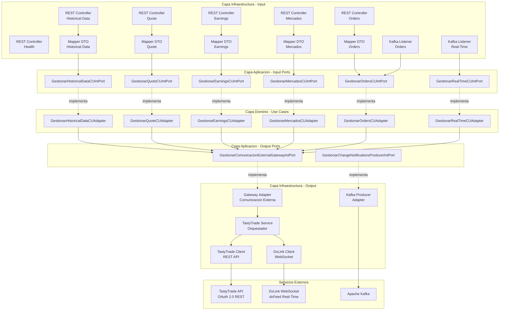
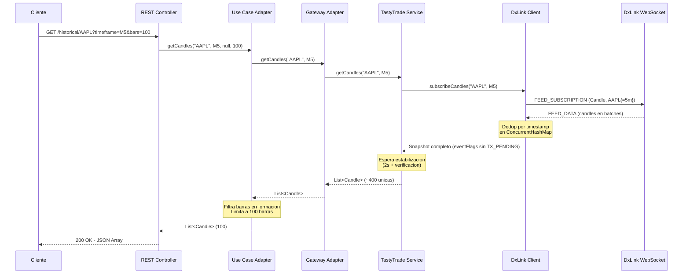

# MarketData Service

Microservicio de datos de mercado para la plataforma **MeTradingPlat**. Provee datos historicos (candles), quotes en tiempo real, earnings, gestion de ordenes y listado de simbolos/mercados, integrando con la API de **TastyTrade** y el WebSocket **DxLink** de dxFeed.

## Tabla de Contenido

- [Arquitectura](#arquitectura)
- [Tecnologias](#tecnologias)
- [Estructura del Proyecto](#estructura-del-proyecto)
- [API Endpoints](#api-endpoints)
- [Integraciones Externas](#integraciones-externas)
- [Kafka Topics](#kafka-topics)
- [Configuracion](#configuracion)
- [Ejecucion](#ejecucion)
- [Limitaciones Conocidas](#limitaciones-conocidas)

## Arquitectura

El servicio implementa **Arquitectura Hexagonal** (Puertos y Adaptadores), separando claramente las capas de dominio, aplicacion e infraestructura.



### Flujo de Datos - Candles Historicas



## Tecnologias

| Tecnologia   | Version     | Proposito                |
| ------------ | ----------- | ------------------------ |
| Java         | 21          | Lenguaje principal       |
| Spring Boot  | 3.5.9       | Framework                |
| Spring Cloud | 2025.0.0    | Eureka, Gateway          |
| Spring Kafka | -           | Mensajeria asincrona     |
| WebSocket    | -           | Conexion DxLink          |
| MapStruct    | -           | Mapeo DTO <-> Dominio    |
| Lombok       | -           | Reduccion de boilerplate |
| Docker       | Multi-stage | Contenedorizacion        |

## Estructura del Proyecto

```
src/main/java/com/metradingplat/marketdata/
├── application/
│   ├── input/                    # Puertos de entrada (interfaces)
│   │   ├── GestionarHistoricalDataCUIntPort.java
│   │   ├── GestionarQuoteCUIntPort.java
│   │   ├── GestionarEarningsCUIntPort.java
│   │   ├── GestionarMercadosCUIntPort.java
│   │   ├── GestionarOrdersCUIntPort.java
│   │   └── GestionarRealTimeCUIntPort.java
│   └── output/                   # Puertos de salida (interfaces)
│       ├── GestionarComunicacionExternalGatewayIntPort.java
│       ├── GestionarChangeNotificationsProducerIntPort.java
│       └── FormateadorResultadosIntPort.java
├── domain/
│   ├── enums/                    # Enumeraciones del dominio
│   │   ├── EnumTimeframe.java    # M1, M5, M15, M30, H1, D1, W1, MO1
│   │   ├── EnumMercado.java      # NYSE, NASDAQ, AMEX, ETF, OTC
│   │   ├── EnumOrderAction.java  # BUY_TO_OPEN, SELL_TO_CLOSE, ...
│   │   └── EnumOrderType.java    # MARKET, LIMIT, STOP, STOP_LIMIT
│   ├── models/                   # Modelos de dominio
│   │   ├── Candle.java
│   │   ├── Quote.java
│   │   ├── EarningsReport.java
│   │   ├── ActiveEquity.java
│   │   ├── BracketOrder.java
│   │   ├── OrderRequest.java
│   │   └── OrderResponse.java
│   └── usecases/                 # Implementacion de casos de uso
│       ├── GestionarHistoricalDataCUAdapter.java
│       ├── GestionarQuoteCUAdapter.java
│       ├── GestionarEarningsCUAdapter.java
│       ├── GestionarMercadosCUAdapter.java
│       ├── GestionarOrdersCUAdapter.java
│       └── GestionarRealTimeCUAdapter.java
└── infrastructure/
    ├── configuration/            # Beans y configuracion Spring
    │   └── BeanConfigurations.java
    ├── input/
    │   ├── controllerGestionarHistoricalData/
    │   │   ├── controller/       # REST Controller
    │   │   ├── DTOAnswer/        # DTOs de respuesta
    │   │   ├── DTORequest/       # DTOs de peticion
    │   │   └── mapper/           # MapStruct mappers
    │   ├── controllerGestionarQuote/
    │   ├── controllerGestionarEarnings/
    │   ├── controllerGestionarMercados/
    │   ├── controllerGestionarOrders/
    │   ├── filter/               # GatewayHeaderFilter
    │   ├── health/               # HealthController (DxLink status)
    │   ├── kafkaGestionarOrders/
    │   └── kafkaGestionarRealTime/
    └── output/
        ├── exceptionsController/ # Manejo global de errores
        ├── external/
        │   ├── gateway/          # Adapter del gateway externo
        │   └── tastytrade/       # Clientes TastyTrade y DxLink
        │       ├── TastyTradeConfig.java
        │       ├── TastyTradeClient.java  # REST (OAuth, ordenes, quotes)
        │       ├── DxLinkClient.java      # WebSocket (candles, streaming)
        │       └── TastyTradeService.java # Orquestador
        └── kafka/
            └── producer/         # KafkaProducerAdapter
```

## API Endpoints

Base path: `/api/marketdata`

### Historical Data

| Metodo | Path                           | Descripcion                                            |
| ------ | ------------------------------ | ------------------------------------------------------ |
| `GET`  | `/historical/{symbol}`         | Obtener candles historicas (solo barras completas)     |
| `GET`  | `/historical/{symbol}/current` | Obtener la barra en formacion (periodo aun no cerrado) |
| `GET`  | `/historical/{symbol}/last`    | Obtener ultima candle completa                         |
| `POST` | `/historical/batch`            | Consulta masiva de candles (listas)                    |
| `POST` | `/historical/batch/last`       | Consulta masiva de ultima candle cerrada               |
| `POST` | `/historical/batch/current`    | Consulta masiva de barra en formacion                  |

**Parametros de `/historical/{symbol}`:**

| Parametro   | Tipo                 | Requerido | Descripcion                                                             |
| ----------- | -------------------- | --------- | ----------------------------------------------------------------------- |
| `symbol`    | String (path)        | Si        | Simbolo del activo (ej: `AAPL`, `SPY`, `BTC`)                           |
| `timeframe` | Enum (query)         | Si        | `M1`, `M5`, `M15`, `M30`, `H1`, `D1`, `W1`, `MO1`                       |
| `endDate`   | ISO DateTime (query) | No        | Fecha limite. Si se omite, usa la hora actual                           |
| `bars`      | Integer (query)      | No        | Numero de barras a retornar. Si se omite, retorna todas las disponibles |

**Comportamiento:**

- Nunca retorna la barra en formacion (la barra cuyo periodo aun no ha cerrado)
- Si `bars` se especifica, retorna las N barras mas recientes
- DxLink entrega ~400-420 candles unicas por consulta (limite del servidor)

**Ejemplos:**

```
GET /api/marketdata/historical/AAPL?timeframe=M5
GET /api/marketdata/historical/SPY?timeframe=M1&bars=15
GET /api/marketdata/historical/TSLA?timeframe=H1&endDate=2026-01-30T16:00:00-05:00
GET /api/marketdata/historical/BTC?timeframe=M1&bars=15
```

**Parametros de `/historical/{symbol}/current`:**

| Parametro   | Tipo          | Requerido | Descripcion                                       |
| ----------- | ------------- | --------- | ------------------------------------------------- |
| `symbol`    | String (path) | Si        | Simbolo del activo                                |
| `timeframe` | Enum (query)  | Si        | `M1`, `M5`, `M15`, `M30`, `H1`, `D1`, `W1`, `MO1` |

**Comportamiento:**

- Retorna la barra cuyo periodo **aun no ha cerrado** (en formacion)
- Retorna `204 No Content` si no hay barra en formacion disponible
- Los valores OHLCV de la barra pueden cambiar hasta que cierre el periodo

**Ejemplos:**

```
GET /api/marketdata/historical/AAPL/current?timeframe=M5
GET /api/marketdata/historical/SPY/current?timeframe=M1
```

**Parametros de `/historical/{symbol}/last`:**

| Parametro   | Tipo          | Requerido | Descripcion                                       |
| ----------- | ------------- | --------- | ------------------------------------------------- |
| `symbol`    | String (path) | Si        | Simbolo del activo                                |
| `timeframe` | Enum (query)  | Si        | `M1`, `M5`, `M15`, `M30`, `H1`, `D1`, `W1`, `MO1` |

**Comportamiento:**

- Retorna la candle completa mas reciente (periodo ya cerrado)
- Retorna `204 No Content` si no hay candles disponibles

**Ejemplos:**

```
GET /api/marketdata/historical/AAPL/last?timeframe=M5
GET /api/marketdata/historical/SPY/last?timeframe=H1
```

**Parametros de `POST /historical/batch`, `/batch/last` y `/batch/current`:**

| Campo       | Tipo           | Requerido | Descripcion                                       |
| ----------- | -------------- | --------- | ------------------------------------------------- |
| `symbols`   | List\<String\> | Si        | Lista de simbolos (ej: `["AAPL", "TSLA"]`)        |
| `timeframe` | Enum           | Si        | `M1`, `M5`, `M15`, `M30`, `H1`, `D1`, `W1`, `MO1` |
| `bars`      | Integer        | No        | Solo para `/batch`: Numero de barras (def: 100)   |

**Comportamiento:**

- `/batch`: Retorna un mapa `candlesPorSimbolo` con **listas** de candles.
- `/batch/last`: Retorna un mapa `candlePorSimbolo` con la **única** última candle cerrada.
- `/batch/current`: Retorna un mapa `candlePorSimbolo` con la **única** barra en formación.
- Ideal para scanners y sincronización de multiples activos en una sola petición.

**Ejemplo Batch Histórico:**

```json
POST /api/marketdata/historical/batch
{
  "symbols": ["AAPL", "MSFT", "GOOGL"],
  "timeframe": "M5",
  "bars": 100
}
```

**Ejemplo Batch Last/Current:**

```json
POST /api/marketdata/historical/batch/last
{
  "symbols": ["AAPL", "TSLA", "NVDA"],
  "timeframe": "M1"
}
```

**Esquema de Respuesta Batch (Varios):**

```json
// POST /batch
{
  "candlesPorSimbolo": {
    "AAPL": [ { "symbol": "AAPL", "timestamp": "...", ... }, ... ]
  },
  "serverTimestamp": "2026-01-30T21:00:00Z"
}

// POST /batch/last o /batch/current
{
  "candlePorSimbolo": {
    "AAPL": { "symbol": "AAPL", "timestamp": "...", ... }
  },
  "serverTimestamp": "2026-01-30T21:00:00Z"
}
```

**Respuesta de candle (aplica a todos los endpoints de Historical):**

```json
{
  "symbol": "AAPL",
  "timestamp": "2026-01-30T20:55:00Z",
  "open": 235.5,
  "high": 236.1,
  "low": 235.3,
  "close": 235.9,
  "volume": 12500.0
}
```

### Quote

| Metodo | Path              | Descripcion                        |
| ------ | ----------------- | ---------------------------------- |
| `GET`  | `/quote/{symbol}` | Obtener quote actual de un simbolo |

**Parametros:**

| Parametro | Tipo          | Requerido | Descripcion                            |
| --------- | ------------- | --------- | -------------------------------------- |
| `symbol`  | String (path) | Si        | Simbolo del activo (ej: `AAPL`, `SPY`) |

**Ejemplo:**

```
GET /api/marketdata/quote/AAPL
```

**Respuesta:**

```json
{
  "symbol": "AAPL",
  "bid": 235.45,
  "ask": 235.55,
  "last": 235.50,
  "volume": 1500000,
  "tradingHalted": false,
  "beta": 1.1,
  ...
}
```

### Earnings

| Metodo | Path                 | Descripcion                         |
| ------ | -------------------- | ----------------------------------- |
| `GET`  | `/earnings/{symbol}` | Obtener proximo reporte de earnings |

**Parametros:**

| Parametro | Tipo          | Requerido | Descripcion                             |
| --------- | ------------- | --------- | --------------------------------------- |
| `symbol`  | String (path) | Si        | Simbolo del activo (ej: `AAPL`, `TSLA`) |

**Ejemplo:**

```
GET /api/marketdata/earnings/AAPL
```

**Respuesta:**

```json
{
  "symbol": "AAPL",
  "occurredDate": "2026-02-01",
  "eps": 1.5,
  "daysUntilEarnings": 12
}
```

### Mercados y Simbolos

| Metodo | Path       | Descripcion                                                |
| ------ | ---------- | ---------------------------------------------------------- |
| `GET`  | `/markets` | Listar mercados disponibles (NYSE, NASDAQ, AMEX, ETF, OTC) |
| `GET`  | `/symbols` | Obtener simbolos filtrados por mercado                     |

**Parametros de `/symbols`:**

| Parametro | Tipo                   | Requerido | Descripcion                                                                  |
| --------- | ---------------------- | --------- | ---------------------------------------------------------------------------- |
| `markets` | List\<String\> (query) | Si        | Lista de mercados separados por coma: `NYSE`, `NASDAQ`, `AMEX`, `ETF`, `OTC` |

**Ejemplos:**

```
GET /api/marketdata/markets
GET /api/marketdata/symbols?markets=NYSE,NASDAQ
```

**Respuestas:**

**GET /markets**

```json
[
  { "code": "NYSE", "name": "New York Stock Exchange" },
  { "code": "NASDAQ", "name": "NASDAQ Stock Market" }
]
```

**GET /symbols?markets=ETF**

```json
[
  {
    "symbol": "SPY",
    "description": "SPDR S&P 500 ETF Trust",
    "listedMarket": "ARCA"
  },
  ...
]
```

### Ordenes

| Metodo   | Path                | Descripcion                   |
| -------- | ------------------- | ----------------------------- |
| `POST`   | `/orders`           | Colocar orden bracket (OTOCO) |
| `DELETE` | `/orders/{orderId}` | Cancelar orden                |

**Request body de `POST /orders`:**

| Campo             | Tipo       | Requerido | Descripcion                                                            |
| ----------------- | ---------- | --------- | ---------------------------------------------------------------------- |
| `symbol`          | String     | Si        | Simbolo del activo                                                     |
| `action`          | String     | Si        | Accion: `BUY_TO_OPEN`, `SELL_TO_OPEN`, `BUY_TO_CLOSE`, `SELL_TO_CLOSE` |
| `quantity`        | Integer    | Si        | Cantidad de acciones (debe ser positivo)                               |
| `entryPrice`      | BigDecimal | Si        | Precio de entrada                                                      |
| `stopLossPrice`   | BigDecimal | Si        | Precio de stop loss                                                    |
| `takeProfitPrice` | BigDecimal | Si        | Precio de take profit                                                  |
| `timeInForce`     | String     | No        | Tiempo en fuerza (ej: `GTC`, `DAY`)                                    |

**Ejemplo request:**

```json
POST /api/marketdata/orders
{
  "symbol": "AAPL",
  "action": "BUY_TO_OPEN",
  "quantity": 10,
  "entryPrice": 235.00,
  "stopLossPrice": 230.00,
  "takeProfitPrice": 245.00,
  "timeInForce": "GTC"
}
```

**Ejemplo response:**

```json
{
  "orderId": "12345",
  "status": "Received",
  "receivedAt": "2026-01-30T15:30:00-05:00",
  "complexOrderId": "67890",
  "rejectReason": null,
  "warnings": [],
  "averageFillPrice": null
}
```

**Parametros de `DELETE /orders/{orderId}`:**

| Parametro | Tipo          | Requerido | Descripcion               |
| --------- | ------------- | --------- | ------------------------- |
| `orderId` | String (path) | Si        | ID de la orden a cancelar |

**Ejemplo:**

```
DELETE /api/marketdata/orders/12345
```

Retorna `204 No Content` si la cancelacion fue exitosa.

### Health

| Metodo | Path                           | Descripcion                |
| ------ | ------------------------------ | -------------------------- |
| `GET`  | `/api/health/dxlink/status`    | Estado de conexion DxLink  |
| `POST` | `/api/health/dxlink/reconnect` | Forzar reconexion a DxLink |

## Integraciones Externas

### TastyTrade REST API

Autenticacion OAuth 2.0 con refresh token. El servicio renueva automaticamente el access token cada 23 horas y guarda el nuevo refresh token en memoria para evitar expiracion.

Endpoints consumidos:

- `POST /oauth/token` - Autenticacion
- `GET /api-quote-tokens` - Token para DxLink
- `GET /instruments/equities/active` - Listado de simbolos
- `GET /market-data/by-type` - Quotes
- `GET /market-metrics/historic-corporate-events/earnings-reports/{symbol}` - Earnings
- `POST /accounts/{id}/orders` - Ordenes simples
- `POST /accounts/{id}/complex-orders` - Ordenes bracket (OTOCO)
- `DELETE /accounts/{id}/orders/{orderId}` - Cancelar orden

### DxLink WebSocket (dxFeed)

Conexion WebSocket persistente para datos de mercado en tiempo real y candles historicas.

- **Protocolo**: dxLink 1.0.2
- **Formato**: COMPACT (mas eficiente que FULL)
- **Reconexion**: Automatica con backoff exponencial (5s, 10s, 20s... hasta 5min)
- **Health check**: Cada 60 segundos
- **Keepalive**: Cada 30 segundos

**Flujo de conexion:**

1. SETUP -> AUTH (con token OAuth) -> CHANNEL FEED -> FEED_SETUP -> FEED_SUBSCRIPTION
2. El servidor envia candles en batches via FEED_DATA
3. `eventFlags & 0x01` (TX_PENDING) indica si el snapshot sigue activo
4. Una vez TX_PENDING = 0, el snapshot esta completo

## Kafka Topics

### Entrada (consumidos)

| Topic                 | Descripcion                                     |
| --------------------- | ----------------------------------------------- |
| `orders.commands`     | Comandos de ordenes desde otros servicios       |
| `marketdata.commands` | Comandos de suscripcion/desuscripcion real-time |

### Salida (publicados)

| Topic               | Key     | Descripcion                               |
| ------------------- | ------- | ----------------------------------------- |
| `orders.updates`    | orderId | Actualizaciones de estado de ordenes      |
| `marketdata.stream` | symbol  | Stream de datos de mercado en tiempo real |

## Configuracion

### Variables de Entorno Requeridas

| Variable                    | Descripcion                                                           |
| --------------------------- | --------------------------------------------------------------------- |
| `TT_CLIENT_ID`              | Client ID de TastyTrade OAuth                                         |
| `TT_CLIENT_SECRET`          | Client Secret de TastyTrade OAuth                                     |
| `TT_REFRESH_TOKEN`          | Refresh token de TastyTrade (se renueva automaticamente en runtime)   |
| `TASTYTRADE_ACCOUNT_NUMBER` | Numero de cuenta TastyTrade                                           |
| `DXLINK_URL`                | URL del WebSocket DxLink (default: `wss://tasty.dxfeed.com/realtime`) |

### Perfiles de Spring

- **dev**: Kafka en localhost:9092, Eureka en localhost:8761, logging DEBUG
- **prod**: Configuracion via variables de entorno del docker-compose

### application.yml

```yaml
server:
  port: 8082

spring:
  application:
    name: marketdata-service
  threads:
    virtual:
      enabled: true # Virtual threads de Java 21

tastytrade:
  api-base-url: https://api.tastytrade.com
  dxlink:
    keepalive-interval: 30000
    connection-timeout: 10000
    accept-data-format: COMPACT
  token-refresh:
    enabled: true
    fixed-rate-hours: 23 # Renueva token antes de las 24h de expiracion
```

## Ejecucion

### Con Docker Compose (recomendado)

Desde la raiz del proyecto `metradingplat/`:

```bash
# Crear archivo .env con las variables requeridas
cp .env.example .env
# Editar .env con tus credenciales de TastyTrade

# Levantar todos los servicios
docker compose up -d

# Ver logs del marketdata-service
docker compose logs -f marketdata-service
```

El servicio estara disponible en `http://localhost:8082` (directo) o `http://localhost:8080/api/marketdata` (via Gateway).

### Desarrollo Local

```bash
cd marketdata-service

# Requiere Java 21, Maven, Kafka y Eureka corriendo localmente
# Configurar variables de entorno o archivo .env

mvn spring-boot:run -Dspring-boot.run.profiles=dev
```

### Servicios del Docker Compose

| Servicio                   | Puerto   | Descripcion          |
| -------------------------- | -------- | -------------------- |
| Zookeeper                  | 2181     | Coordinador Kafka    |
| Kafka                      | 9092     | Message broker       |
| PostgreSQL (marketdata)    | 5432     | Base de datos        |
| PostgreSQL (scanners)      | 5433     | Base de datos        |
| Directory (Eureka)         | 8761     | Service registry     |
| Gateway                    | 8080     | API Gateway          |
| scanner-management-service | 8081     | Servicio de scanners |
| **marketdata-service**     | **8082** | **Este servicio**    |

## Limitaciones Conocidas

- **~400-420 candles por consulta**: DxLink entrega ~700 eventos raw que despues de deduplicacion quedan ~400-420 candles unicas. Es una limitacion del servidor.
- **Refresh token**: TastyTrade expira el refresh token cada 24 horas. El servicio lo renueva automaticamente en runtime, pero si el servicio se reinicia despues de 24h sin actividad, se necesita un refresh token nuevo en la variable de entorno.
- **Mercado cerrado**: En fines de semana y feriados no hay candles nuevas de equities. La API responde normalmente pero con datos del ultimo dia de trading.

- **BTC**: El simbolo en TastyTrade/DxLink es simplemente `BTC` (no `BTC/USD`). Tiene menor liquidez que equities, las candles de minuto pueden tener gaps.

## Arquitectura de Multiplexación DxLink

Para optimizar el rendimiento y permitir la concurrencia real en solicitudes de datos históricos (especialmente para scanners con múltiples símbolos), se implementó una arquitectura de multiplexación sobre la conexión WebSocket de DxLink.

### Conceptos Clave

1.  **Conexión Única (Single Socket)**:
    - Existe **una sola** conexión física persistente (TCP/WebSocket) hacia los servidores de DxLink (`wss://tasty.dxfeed.com/realtime`).
    - Esta conexión maneja la autenticación, los "keepalives" y el "heartbeat".

2.  **Canal Default (ID 1)**:
    - Se crea automáticamente al conectar.
    - Es persistente y se reconecta automáticamente si la conexión WebSocket se cae.
    - Se utiliza para suscripciones de streaming en tiempo real (Quotes, Trades) que deben permanecer activas indefinidamente.

3.  **Canales Efímeros (On-Demand)**:
    - Se crean dinámicamente (`dxLinkClient.openNewChannel()`) para tareas específicas, como una solicitud batch de candles históricas.
    - **Aislamiento**: Cada solicitud tiene su propio `channelId`. Los mensajes del servidor vienen etiquetados con este ID, permitiendo enrutar las respuestas exactamente al hilo que hizo la solicitud.
    - **Ciclo de Vida Corto**: Estos canales se abren, se utilizan para la suscripción, se recibe la data, y **se cierran inmediatamente** una vez completada la tarea o tras un timeout.
    - **Sin Reconexión**: A diferencia del canal default, estos canales no se reconectan automáticamente. Si la conexión global se cae durante una solicitud batch, esa solicitud fallará y deberá ser reintentada por el cliente.
